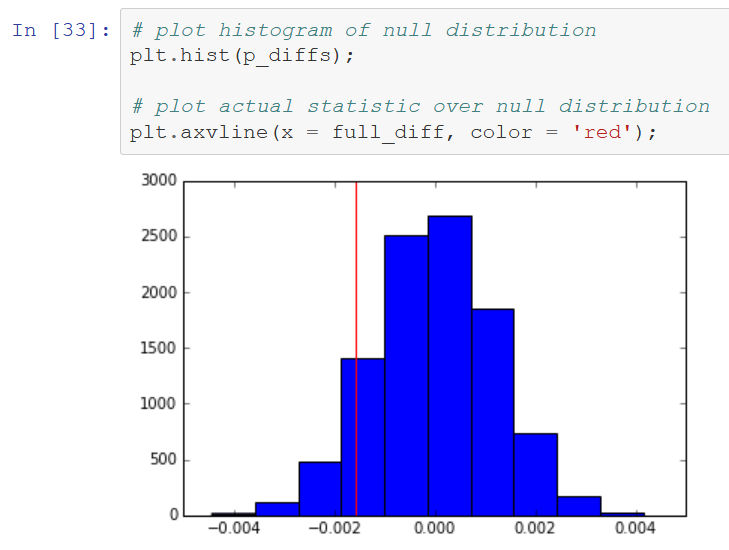

# Analyze A/B Test Results

This project investigates the results of an A/B test run by an e-commerce website, created as part of the [Data Analyst Nanodegree by Udacity](https://www.udacity.com/course/data-analyst-nanodegree--nd002). The company has developed a new web page in order to try and increase the number of users who convert, meaning the number of users who decide to pay for the company's product. The goal is to help the company understand if they should implement this new page, keep the old page, or perhaps run the experiment longer to make their decision. The logical process and conclusions are presented in a Jupyter Notebook.

### Skills Demonstrated

- A/B hypothesis testing, p-values, z-scores, linear and logistic regression.
- Wrangling data into a consistent usable format.
- Python and its extension modules NumPy, pandas, and matplotlib.
- Vectorized operations to optimize code performance.
- Visualizations using advanced features of matplotlib.
- Communicating analysis results using Jupyter Notebooks.

#### An interactive execution of matplotlib using a Jupyter Notebook.

